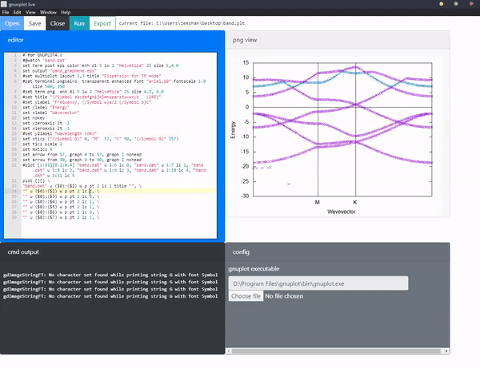

# gnuplot-live
live editor for gnuplot when one is too lazy to switch windows

[download installer](https://github.com/zeeshahmad/gnuplot-live/releases/download/v0.1.0/gnuplot-live.Setup.0.1.0.exe)

# building

`npm install`

`npm run electron-dev`

`npm run electron-pack`

# usage

0. install gnuplot
1. point to `gnuplot.exe` in `config` area
2. open `.plt` file or type gnuplot code in editor
3. use

